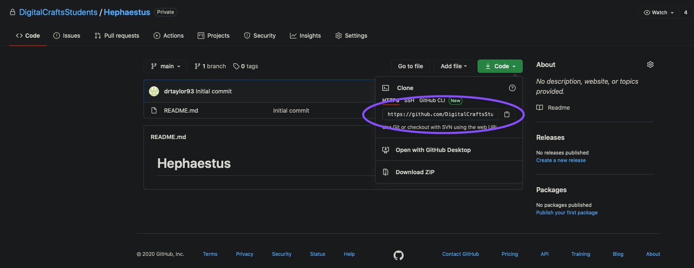
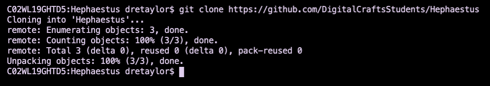
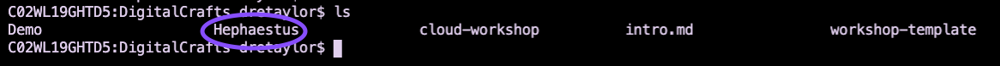

# Getting Started
## Learning Git

This repo will be used to store all the work you will complete for this class. Here are some intro commands to git you started.

Go to https://github.com/DigitalCraftsStudents/Hephaestus. Click on the green `Code` button and copy the URL as seen here.

Open VS Code and go to the terminal. Create a directory that will hold all the files that you will be using. This will be your workspace. Make sure this directory is easy to find.

:::Bonus:::
Try to create the directory and files using the terminal. In linux, use commands `touch`, `rm`, `mkdir`, and `cd` to create and navigate to the workspace.

Once you have created your workspace and have navigated into the  respective directory, run

`git clone URL_OF_GITHUB_REPO_GOES_HERE`

If successful, your terminal should look something like this

Now check that the GitHub repo has successfully been cloned onto your local machine. Run `ls` and you should see a directory by the name of Hephaestus present. Enter that directory by running `cd Hephaestus`. 

